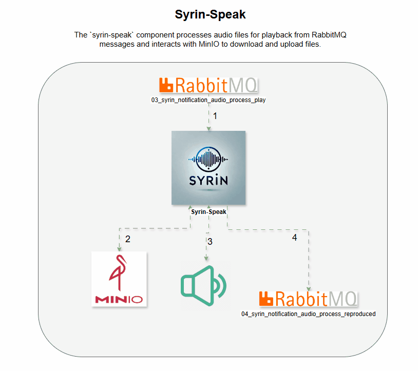

# Syrin Speak Audio Agent

## Description

The `syrin-speak` component processes audio files for playback from RabbitMQ messages and interacts with MinIO to download and upload files. The agent performs the following tasks:

1. Downloads audio files from MinIO.
2. Plays audio on available audio output devices.
3. Uploads reproduced audio to a subfolder in MinIO.
4. Deletes the original and local files after processing.
5. Publishes messages to confirm successful processing.

## Demo



## Features

- **RabbitMQ**: Connects to RabbitMQ queues to receive and process audio messages.
- **MinIO**: Downloads and uploads audio files to MinIO storage.
- **Audio Playback**: Attempts audio playback on all available output devices until successful.
- **Reprocessing Queue**: Sends messages to a reprocessing queue if playback fails.

## Requirements

- **Python 3.x**
- **Python Libraries**:
  - `pika` (RabbitMQ interaction)
  - `minio` (MinIO integration)
  - `sounddevice` (audio playback)
  - `numpy` (audio data processing)
  - `wave` (WAV file handling)

Install dependencies with:
```bash
pip install pika minio sounddevice numpy wave
```

## Configuration

Settings are loaded from environment variables:

### RabbitMQ Settings

- `RABBITMQ_HOST`: RabbitMQ host (default: `127.0.0.1`)
- `RABBITMQ_PORT`: RabbitMQ port (default: `5672`)
- `RABBITMQ_VHOST`: RabbitMQ virtual host
- `RABBITMQ_USER`: RabbitMQ username
- `RABBITMQ_PASS`: RabbitMQ password
- `RABBITMQ_TTL_DLX`: Message TTL in ms (default: `60000`)

### MinIO Settings

- `MINIO_URL`: MinIO host (default: `127.0.0.1`)
- `MINIO_PORT`: MinIO port (default: `9000`)
- `MINIO_ROOT_USER`: MinIO username
- `MINIO_ROOT_PASSWORD`: MinIO password
- `MINIO_BUCKET_WORK`: MinIO bucket (default: `syrin`)

## How to Run

1. Configure environment variables.
2. Start the agent:

```bash
python syrin-speak.py
```

The agent consumes messages from `03_syrin_notification_audio_process_play`, processes them, and publishes to other queues if successful.

## Service Installation

1. Copy `syrin-speak.py` to `/usr/local/bin` and make it executable.
2. Copy the systemd service file `syrin-speak.service` to `/etc/systemd/system`.
3. Reload systemd, enable, and start the service:

```bash
sudo systemctl daemon-reload
sudo systemctl enable syrin-speak.service
sudo systemctl start syrin-speak.service
```

4. Check service status and logs:

```bash
sudo systemctl status syrin-speak.service
journalctl -u syrin-speak.service -f
```

## License

This project is licensed under the MIT License.
